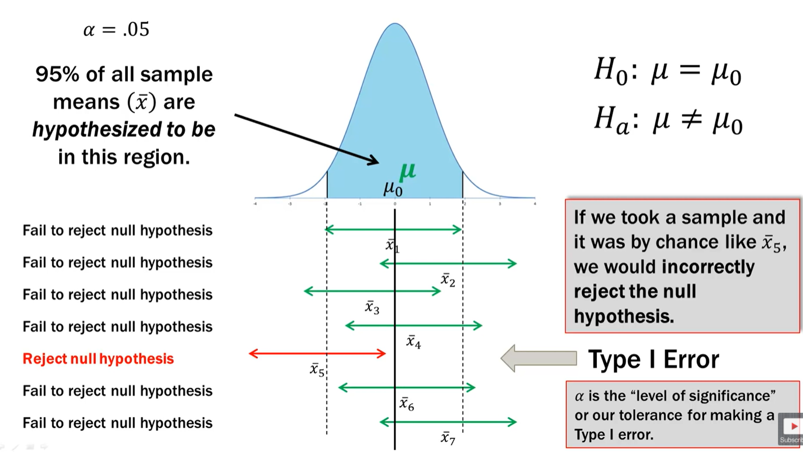
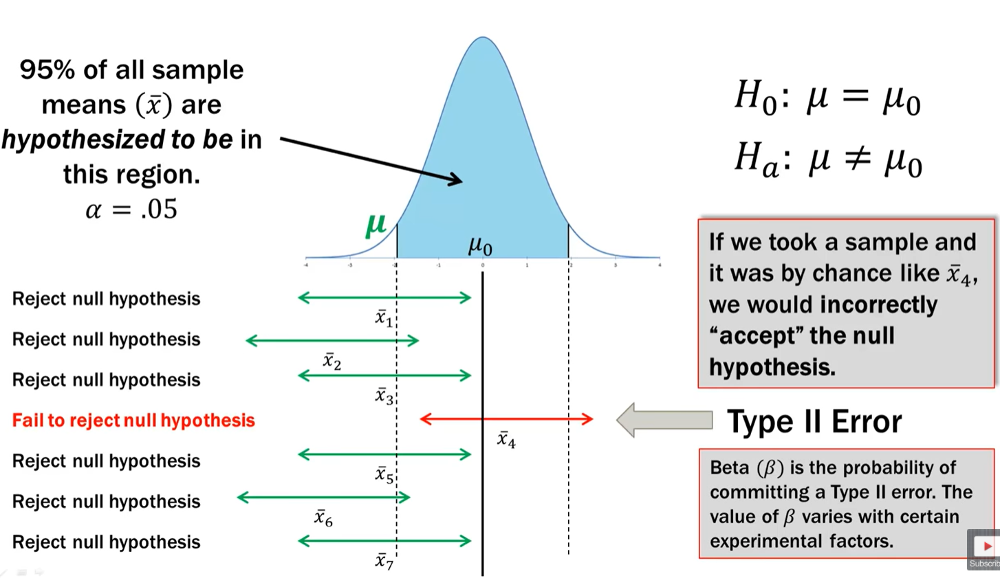
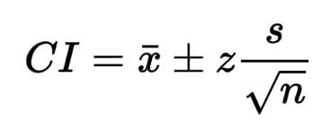
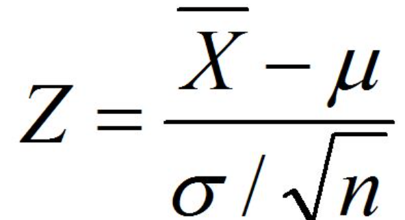
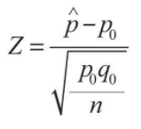

# Experimental Design
### Principals
* **Control**: compare treatment to control group
* **Replicate**: large Sample or Replicate
* **Randomize**: Randomly assign subjects to treatments
* **Block**: Covariance Analysis
  + Randomized Complete Block Design:
    + Each Block sees each treatment once.
    + Random within each block
  + Balanced Incomplete Block Design
    + not every treatment will appear in every block
  + Latin Squares
    + 2 blocking variables
    + same levels
    + No Interactions
  + Factorial Designs
    + Interactions Considered

### Sampling
> If Sampling of sample size **n** is RANDOM, then the sample is UNBIASED & REPRESENTATIVE of the population. \
Thus, any results based on the sample can GENERALIZE to the population parameter

**Simple Random Sample**:\
**Stratified Sample**:\
**Clustered Sample**:\
**Multistage Sample**:

**Bootstrap**: Sampling with Replacement. *mimics Sampling Distribution using a single sample*\
**Permutation**: Sampling without Replacement. _shuffled dataset assuming Null is true_

### Testing Procedure
1. Well Developed, Clear Research Problem
2. Establish Null
3. Determine Appropriate Statistical Test & Sampling Distribution
4. Choose Type I Error rate "alpha"
5. State Decision Rule
6. Gather Sample Data
7. Calculate Test Statistic
8. State Statistical Conclusion
9. Make Decision of Inference Based on Conclusion

---

# Hypothesis Testing
> "Does our conclusion match the overall state of Reality"\
"Did our sample come from the same population we assume is underlying the Null"

**Null**: Status Quo - Assumed - Given\
**Alternative**: Claim - Assertion - Unknown

Null = True | Alt = True
 --- | ---
x correctly inside non-reject region | x inside non-reject region due to chance. **Type II - B**
x outside non-rejection region due to chance. **Type I - a** | x correctly outside nonrejection Region. **Power: 1 - B**

  
  

---

# Inference

## Confidence Interval
* When estimating a population parameter using a sample statistic it's never going to be perfect. _Express that error using Interval Estimate_.
* Randomness lies in the element choosen from the sample
* Proportion of Samples _size n_ for which our estimate the _sample mean_ is within a certain distance +_ of the true population mean. **NOT** the probability that the population mean lies within the interval
* _"95% of all intervals made using  will contain the population parameter"_

## Single Sample

z-test (x) | z-test (p)
--- | ---
 | 

## Two Population

## Chi-Squared

## ANOVA
